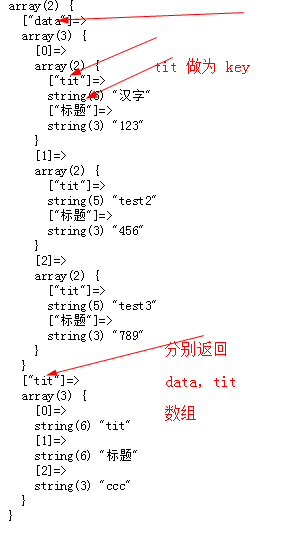

### 项目说明
数组导出 CSV、ZIP 文件， CSV、ZIP 文件还原数组（Array export file, file restore array）
适用于**导入导出会员、商品信息** 
所有配置项 `ExecData` 中配置   
**注意：** 读取中文文件名文件、数据时需要注意本地区域设置 
    写入文件数据是 UTF-8 ，设置 `FetchFile 类中 fetchFile() 函数中 setlocale(LC_ALL, 'US')`才可读取到数据； 
    测试平台为WIN,其他平台未测试； 
    如果不能读取数据，请根据相应地区字符编码设置  

### 相比1.0.3 版本
**调整**
- 导入数据返回方式

### 数据转码编码说明
- PHP 文件编码与网页编码 `$this->config[ 'webChar']` 一致都为UTF-8
- 写入文件时，传入的文件名（参数）编码是UTF-8（PHP 文件编码），将文件名转换为 `$this->config[ 'fileNameChar']` （GBK），否则中文文件名乱码，数组数据编码为传入时原数据编码UTF-8（PHP 文件编码）
- 读取文件时，判断文件是否存在，传入的文件名（参数）编码为UTF-8（PHP 文件编码），中文文件名必须转为 `$this->config['fileNameChar']` （GBK）才能判断
- 读取文件数据时，原数据如果有中文，会出现乱码，需要重新设置输入输出编码为 UTF-8（PHP 文件编码,网页编码）
- 读取压缩文件中某个指定的文件时（按照文件名读取时），传入的参数为UTF-8（PHP 文件编码），写入压缩包时文件名为 `$this->config[ 'fileNameChar']` （GBK）；读取压缩包文件（根据传入的文件名读取）数据时，文件名编码必须一致，否则读取不到数据

### 文件说明
|--- datafile/ &emsp;           导出导入文件存放位置**必须有创建、写入、读取权限** 
|--- log/ &emsp; &emsp; &ensp;  读取文件是错误日志存放位置**必须有创建、写入权限** 
|--- src/ 
    |--- dome.php &emsp;&ensp;  示例文件 
    |--- ExceData.php &ensp;    执行读写操作调用类文件 
    |--- FetchFile.php &ensp;   读取文件操作类 
    |--- Pub.php &emsp;&emsp;   读写操作基类 
    |--- WriteFile.php &emsp;   数组写入文件（下载）类 
|--- test/&emsp;&emsp;&emsp;&ensp;示例图片 

### 数组数据导出（下载） CSV / ZIP 文件
传入数组，如果限制每个文件的数据条数小于数组长度，自动生成压缩文件； 
如果限制每个文件的数据条数大于数组长度，根据参数设置是否压缩文件；

调用示例： 
`$exec=new ExecData();
 $exec->writeData($two);`;

共5个参数,第一个参数必填，其他参数可选
<pre>
 * @param $data 数组数据
 * @param $tit csv 文件title, Array 或者 'aa,bb' 字符串类型,建议数组长度与数据每个二维数据长度一致
 * @param $limit 每个文件数据条数
 * @param $filename 文件名，不加后缀，例如 `aa`,生成的文件是 `aa.csv /aa.zip`；默认文件名 `WriteFile->defaultFileName()`函数定义
 * @param $compr 单个文件是否压缩，默认 false 不压缩
 </pre>

### CSV / ZIP 文件 还原 Array 数据
读取CSV文件，返回数组; 
如果读取压缩包中所有文件如果没有错误，获取数组后会自动删除源文件；
如果有错误，会输出提示信息，可以通过 `ExecData` 类文件中的 `fetchData` 函数配置项中的 `logOut`设置是否输出
读取文件压缩包，压缩包有多少个有内容的文件，就返回几个数组   
如果读取整个文件并且没有错误，是否删除源文件可以通过配置 `FetchFile` 类中 `$this->config["isDelFile"]=false` 设置，默认不删除，值为`false` 
修改读取文件时错误日志存放位置配置： 
`ExceData` 文件 `fetchData()` 函数中 `$f_config['logFile']` 设置成自定义即可

调用示例： 
`$exec=new ExecData();
 $exec->fetchData("compress2.csv");`

共4个参数,第一个参数必填，其他参数可选
<pre>
 * @param $filename 要读取的文件名
 * @param bool 是否返回文件中的tit，默认false 不返回;
 * @param bool 是否将 csv 文件中的tit 做为数组的 key ,默认false 返回索引数组
 * @param int/string
 * int读取第几个文件的数据，默认0 读取所有文件，如果压缩文件中只有一个文件忽略此参数
 * 如果 $index=1,读取第一个文件;
 * string 要读取的文件名如果嵌套文件 请添加文件夹路径 例如 aa/aa.csv,$fileway 参数必须为 false
 </pre>

